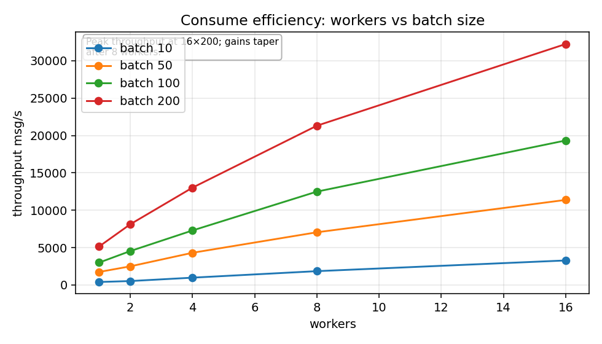
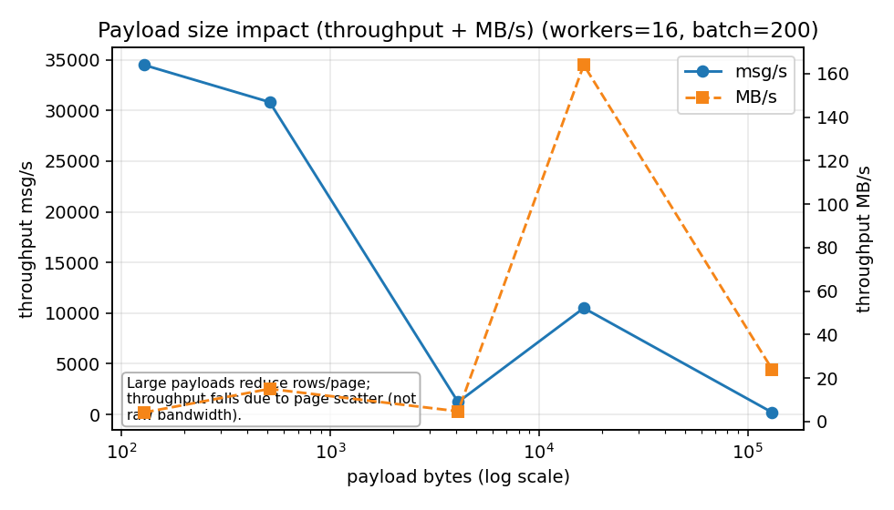
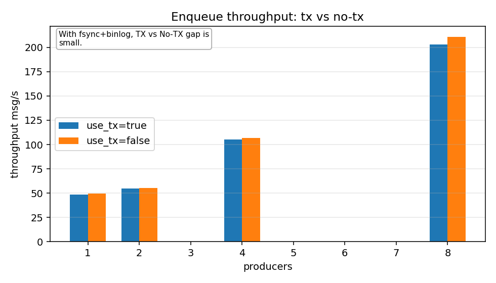
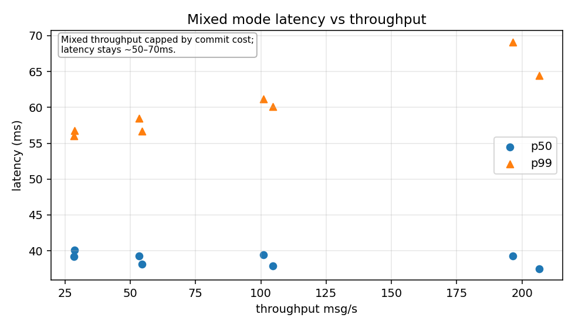
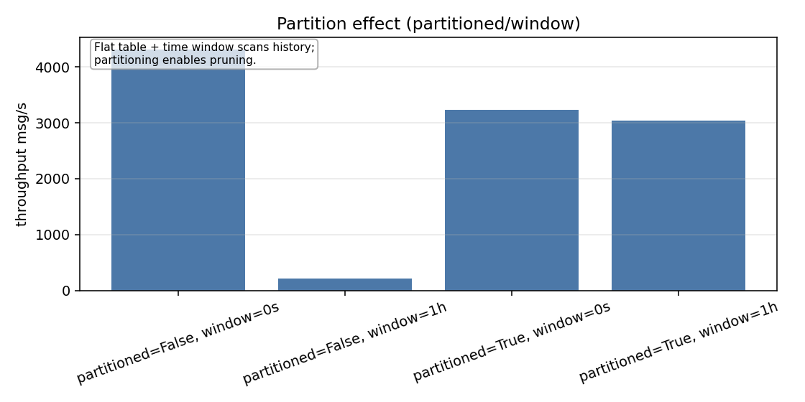
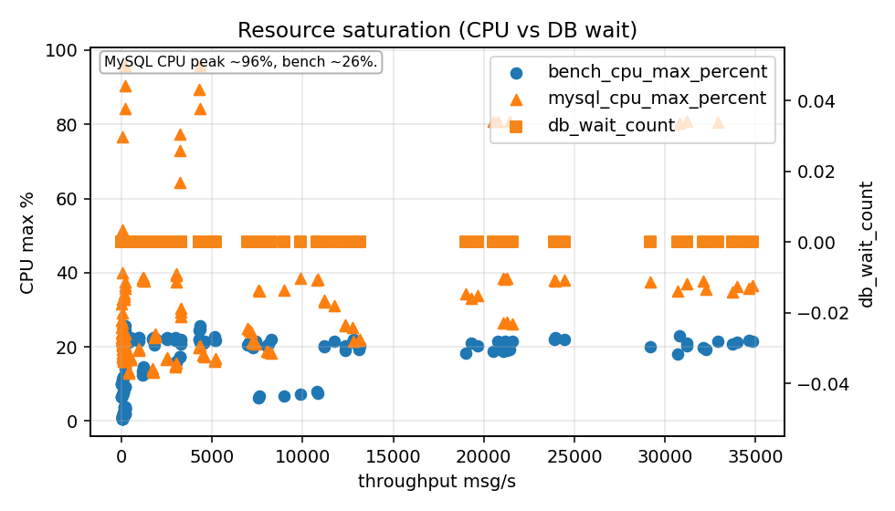

# Outbox Bench Report - 2025-12-25 (RUN_ID=20251225T225119Z)

## Overview

This report summarizes the latest full benchmark run of the MySQL outbox harness. The goal is to quantify throughput,
latency, and the practical impact of tuning knobs (workers, batch size, payload size, partition pruning) under a
**prod-like durability profile**.

**Environment (from metadata):**

- Plan: `full`
- MySQL: `8.0.36` (Docker `mysql:8.0.36`)
- Durability: `innodb_flush_log_at_trx_commit=1`, `sync_binlog=1`
- Buffer pool: `1GB`, redo log: `512MB`, `innodb_io_capacity=5000`
- CPU: Intel i7-12700H (20 threads), RAM 31Gi

**Run configuration highlights:**

- Records: consume/enqueue/mixed = 200k
- Payload sweep: 128B, 512B, 4KB; large payload sweep: 16KB, 128KB
- Mixed mode enabled with `drain_timeout=2m`
- Partition effect: 2M rows distributed across 90 days
- `auto-target` enabled (consume target adjusted to visible rows under `partitionWindow`)

---

## 1) Consume scaling: Workers x Batch size



**Key takeaways:**

- Best throughput in consume-only mode is **~32k msg/s** at **16 workers x batch 200**.
- Scaling is strong up to 8-16 workers; beyond that the gains are smaller.
- Batch size 200 clearly dominates smaller batches for throughput in this profile.

Top combos by mean throughput (consume, payload 512B):

- **16 workers / batch 200** -> ~32,232 msg/s
- **8 workers / batch 200** -> ~21,304 msg/s
- **16 workers / batch 100** -> ~19,330 msg/s

This is the upper bound of the relay + SELECT...SKIP LOCKED path when no concurrent inserts compete.

---

## 2) Payload size impact (throughput vs size)



**Small payload sweep (200k records):**

- 128B -> **~29,292 msg/s** (~3.6 MB/s)
- 512B -> **~26,003 msg/s** (~12.7 MB/s)
- 4KB -> **~1,199 msg/s** (~4.7 MB/s)

**Large payload sweep (20k records):**

- 16KB -> **~9,271 msg/s** (~145 MB/s)
- 128KB -> **~184 msg/s** (~23 MB/s)

**Interpretation:**

- The drop between 512B and 4KB is steep and is best explained by **page scatter**: larger rows reduce the number of
  rows per clustered-index page, so each batch requires many more page fetches. This is not raw bandwidth saturation;
  it is dominated by random page reads and buffer-pool churn.
- Large payload sweep uses only **20k records**, so these numbers can be more optimistic due to cache effects.
  Treat the 16KB curve as a directional signal, not a directly comparable throughput to the 200k runs.

---

## 3) Enqueue: Transaction cost (TX vs No-TX)



With strict durability (fsync + binlog sync), **TX and No-TX are close** in this profile:

- 8 producers:
  - `use_tx=true` -> **~203 msg/s**
  - `use_tx=false` -> **~211 msg/s**

Interpretation: under `sync_binlog=1` and per-statement fsync, the difference between explicit and implicit
transaction cost is not dramatic. The MySQL commit path is the dominant limiter either way.

---

## 4) Mixed workload: throughput vs latency



Top mixed-mode configuration:

- **16 workers / batch 200 / 8 producers**
- **~207 msg/s** throughput
- **p95 latency ~54 ms**, **p99 ~64 ms**
- **max lag ~15 messages**

This highlights the real production-like limit: once inserts and consumes compete, the system is dominated by the
enqueue path and strict durability. The relay itself can do 30k+ msg/s in isolation, but the mixed workload collapses
into the ~200 msg/s region due to commit costs.

---

## 5) Partition effect: pruning on/off



Partition effect runs used **2M rows spread across 90 days** with `partitionWindow=1h`.
Because only the most recent day intersects the window, `auto-target` adjusted the consume target to **~22,222 rows**.

Results:

- `partitioned=true`, `window=1h` -> **~3,042 msg/s**
- `partitioned=false`, `window=1h` -> **~212 msg/s**
- `partitioned=true`, `window=0` -> **~3,226 msg/s**
- `partitioned=false`, `window=0` -> **~4,310 msg/s**

**Interpretation:**

- Applying a time window to a **flat FIFO table** (`ORDER BY id ASC`) forces a scan from the oldest rows until the
  recent time slice is found. That is why `partitioned=false + window=1h` collapses to ~212 msg/s: it walks history.
  Partitioning fixes this by physically separating history, allowing pruning to skip cold ranges.
- When a window is used, **partitioning delivers ~14x improvement** (pruning works).
- Without a window, partitioning can be a net loss (extra overhead, no pruning benefit).

This makes the partition-window + partitioned-schema pair a package deal: use them together or neither.

**Working-set effect:** the same consume path drops from ~32k msg/s (200k backlog) to ~4.3k msg/s (2M backlog). With a
1GB buffer pool, the larger working set no longer fits in memory, so index/page churn becomes a dominant cost.

---

## 6) Resource saturation



Peak CPU observed during runs:

- **MySQL CPU ~96%**
- **Benchmark process CPU ~26%**

This indicates that the database is the primary bottleneck in the prod-like profile.

---

## Conclusions

1. **Relay throughput ceiling is high (~32k msg/s)** in consume-only mode with 16x200, but
   **mixed mode collapses to ~200 msg/s** due to insert commit cost under strict durability.
2. **Partitioning only helps when you actively prune**. A time window on a flat FIFO table forces historical index
   scans; partitioning avoids that by physically separating old data.
3. **Working-set size matters**. Throughput drops sharply when the backlog grows beyond the buffer pool.
4. **Payload size matters sharply**: larger rows increase page scatter and degrade throughput by an order of magnitude.
5. **MySQL CPU is the bottleneck** in this prod-like profile.

---

## Recommendations (based on this run)

- For **max relay throughput**: use `batch=200`, `workers=16` (or 8 if CPU constrained).
- For **partitioned schemas**: always set `PartitionWindow` to keep scans within hot partitions.
- **Do not apply `PartitionWindow` on a non-partitioned table**; it forces historical index scans and degrades
  performance.
- For **mixed workloads**: treat enqueue durability cost as the primary limiter; scale with more DB capacity rather than
  more workers alone.
- For **payload sizing**: keep payloads small or move large payloads out-of-band (object store + pointer pattern).

---

## Reproduce

```bash
RUN_ID=20251225T225119Z RESUME=1 MYSQL_PROFILE=prod REPEATS=3 WARMUP=1 AUTO_TARGET=1 \
CONSUME_RECORDS=200000 ENQUEUE_RECORDS=200000 MIXED_RECORDS=200000 MIXED=1 \
PARTITION_AHEAD=168h PARTITION_LOOKBACK=0s PARTITION_WINDOW=1h \
PARTITION_EFFECT_RECORDS=2000000 PARTITION_EFFECT_DAYS=90 \
PARTITION_EFFECT_SEED_AGE=0 PARTITION_EFFECT_LOOKBACK=2160h \
LARGE_PAYLOAD_RECORDS=20000 \
./scripts/benchmarks-run.sh
```

Plots were generated with:

```bash
.venv-bench/bin/python scripts/benchmarks-plot.py docs/benchmarks/results/20251225T225119Z/results.csv
```
