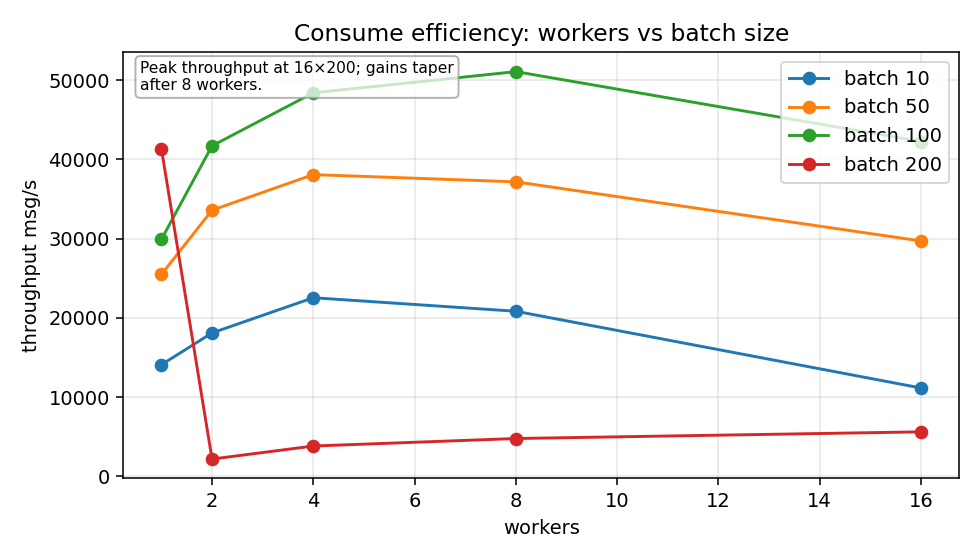
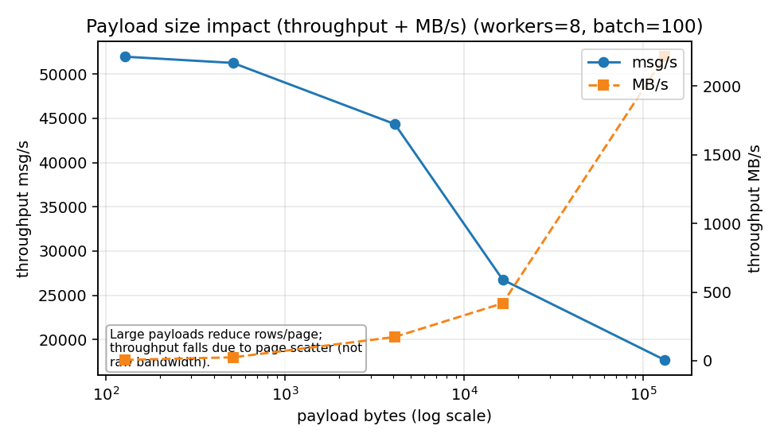
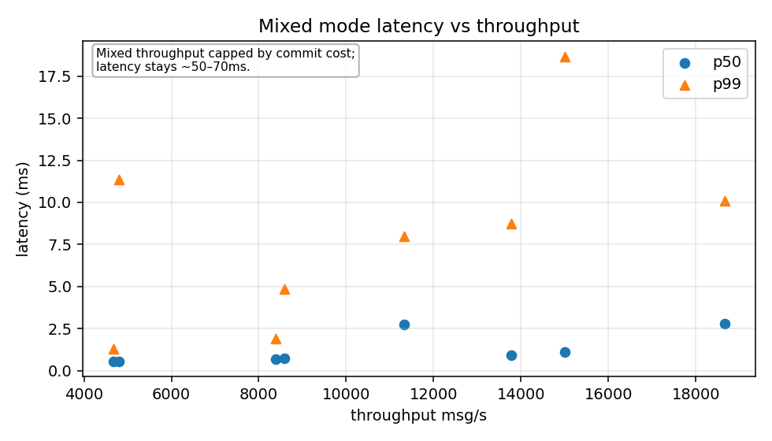
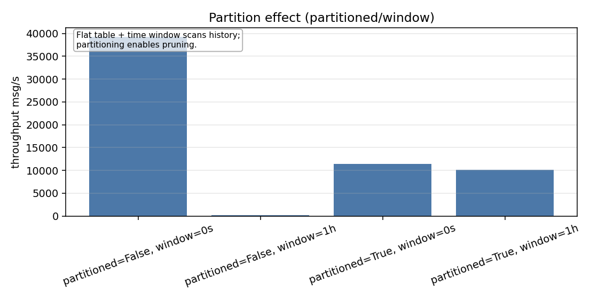
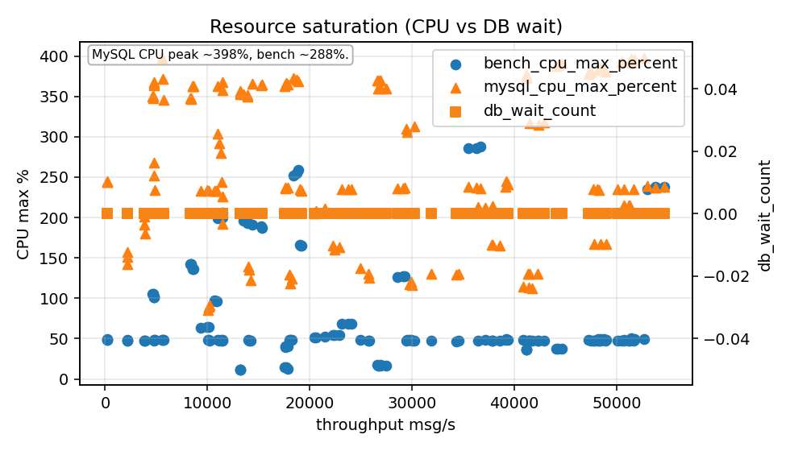

# Outbox Bench Report - 2025-12-28 (RUN_ID=20251228T165819Z)

## Overview

This run targets **library/SQL loop capacity** using tmpfs and relaxed durability. It is intentionally optimistic and
measures how fast the outbox library can drive MySQL when fsync/binlog overheads are minimized.

**Environment (from metadata):**

- Plan: `full`
- MySQL: `8.0.36` (Docker `mysql:8.0.36`)
- Durability: `innodb_flush_log_at_trx_commit=2`, `sync_binlog=0`
- Buffer pool: `1GB`, redo log: `512MB`, `innodb_io_capacity=5000`
- CPU: Intel i7-12700H (20 threads), RAM 31Gi
- `auto-target` enabled (consume target adjusted to visible rows under `partitionWindow`)

---

## 1) Consume scaling: Workers x Batch size



**Key takeaways:**

- Peak throughput is **~51k msg/s** at **8 workers x batch 100**.
- Scaling saturates earlier than prod: the best combos cluster around batch=100 and workers 4-8.

Top combos by mean throughput (consume, payload 512B):

- **8 workers / batch 100** -> ~51,080 msg/s
- **4 workers / batch 100** -> ~48,407 msg/s
- **16 workers / batch 100** -> ~42,263 msg/s

This is a good approximation of the library's upper bound without durability pressure.

---

## 2) Payload size impact (throughput vs size)



**Small payload sweep (200k records):**

- 128B -> **~50,225 msg/s** (~6.1 MB/s)
- 512B -> **~49,565 msg/s** (~24.2 MB/s)
- 4KB -> **~42,761 msg/s** (~167 MB/s)

**Large payload sweep (20k records):**

- 16KB -> **~26,899 msg/s** (~420 MB/s)
- 128KB -> **~15,452 msg/s** (~1.9 GB/s)

**Interpretation:**

- With tmpfs and relaxed durability, large payloads are **not bandwidth-limited**; the system can saturate memory/cache.
- The primary risk with larger payloads remains **page scatter** (fewer rows per clustered-index page), but the penalty
  is muted compared to the prod-like run.

---

## 3) Enqueue: Transaction cost (TX vs No-TX)


With relaxed durability, the transaction penalty is visible but not extreme:

- 8 producers:
  - `use_tx=true` -> **~36,178 msg/s**
  - `use_tx=false` -> **~53,828 msg/s**

This shows the ceiling of the enqueue path when fsync/binlog is not the dominant limiter.

---

## 4) Mixed workload: throughput vs latency



Top mixed-mode configuration:

- **4 workers / batch 100 / 8 producers**
- **~18,668 msg/s** throughput
- **p95 latency ~6.4 ms**, **p99 ~10.1 ms**
- **max lag ~536 messages**

In this "fast" profile, mixed throughput is driven by the relay/SQL loop rather than commit costs.

---

## 5) Partition effect: pruning on/off



Partition effect runs used **2M rows spread across 90 days** with `partitionWindow=1h`.
`auto-target` adjusted the consume target to **~22,222 rows** inside the window.

Results:

- `partitioned=true`, `window=1h` -> **~10,148 msg/s**
- `partitioned=false`, `window=1h` -> **~241 msg/s**
- `partitioned=true`, `window=0` -> **~11,445 msg/s**
- `partitioned=false`, `window=0` -> **~39,239 msg/s**

**Interpretation:**

- A time window on a **flat FIFO table** forces historical index scans; throughput collapses to ~241 msg/s.
- Partitioning + window restores performance by pruning cold history (~42x faster than flat+window).
- Without a window, a flat table is faster (no partition overhead, sequential scan of the PK).

---

## 6) Resource saturation



Peak CPU observed during runs (process CPU can exceed 100% because it sums cores):

- **MySQL CPU ~398%**
- **Benchmark process CPU ~288%**

This shows the system is CPU-bound under tmpfs; disk IO is largely removed from the equation.

---

## Conclusions

1. **Library/loop ceiling is high**: consume-only peaks at ~51k msg/s with 8x100.
2. **Mixed throughput is ~18k msg/s** with low latency (<10 ms p99) when durability is relaxed.
3. **Partitioning helps only with pruning**; without a window it is overhead.
4. **Flat + window is a trap**: it forces historical scans and destroys throughput.
5. **Large payloads are feasible in tmpfs**; penalties are primarily page scatter, not bandwidth.

---

## Recommendations (fast profile)

- Use **8 workers x batch 100** as the default ceiling for pure consume throughput in memory-bound runs.
- Keep `PartitionWindow` **only with partitioned tables**.
- If you need maximum enqueue throughput, `use_tx=false` shows the upper limit of the path.

---

## Reproduce

```bash
RUN_ID=20251228T165819Z RESUME=1 MYSQL_PROFILE=fast USE_TMPFS=1 DATA_SIZE=24g \
PLAN=full REPEATS=3 WARMUP=1 AUTO_TARGET=1 \
./scripts/benchmarks-run.sh
```

Plots were generated with:

```bash
.venv-bench/bin/python scripts/benchmarks-plot.py docs/benchmarks/results/20251228T165819Z/results.csv
```
